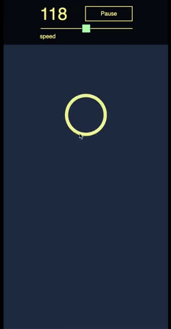

# :fire: DOTS: THE GAME :fire:

Inspired by the literary epic _Beowulf_, _Dots_ follows the story of a hero's struggle and eventual triumph over the titular dots, as he tries against all odds to click them all.

## Features

- Redux-like state-management using `React.CreateContext`
- Dynamic visual style based on the game-speed
- Javascript-based SVG animations
- Responsive design - the game area is consistent across all devices

## Technology

- React
- Styled-components
- No other libraries
